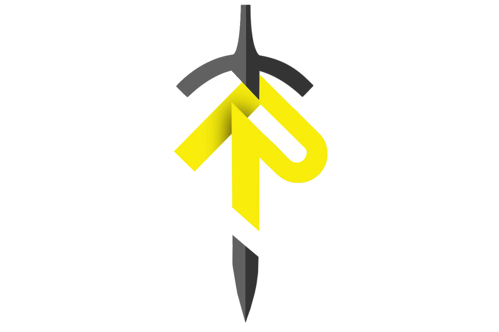

<p align="center">
  
</p>

<h1 align="center"><b>Hero_Shoot</b></h1>

<div align="center">

**任意点位雷达辅助吊射校准框架**

</div>

---

## 项目简介

本项目为适应 2026 赛季英雄机器人「盲区」规则变化而专门开发的激光雷达辅助吊射校准框架。上赛季已有部分学校成功搭载激光雷达实现吊射辅助校准，为此我们在本赛季决定着手开发相关功能。

框架以 SLAM 定位为基础，借助重定位构建完整 TF 树，通过查询 `map → chassis → muzzle` 变换链，实时获取枪管末端在场地坐标系下的位姿；结合先验目标点，依次完成 **Yaw 轴对准 → Pitch 弹道解算** 的两阶段闭环控制，最终实现在车辆任意点位状态下的自动吊射校准。得益于北极熊战队导航开源框架的泛用性基础，本框架在其之上快速迭代开发完成。

整体工程包含两个独立工作空间：
- **Real**：实车算法层，按功能模块严格划分包边界，具备较高可读性与可移植性。
- **Simulation**：基于北极熊战队 Gazebo Ignition 仿真器改造，新增 `ign_sim_pointcloud_tool` 点云适配与 `sim_adapter` 接口转换包，在无实车与下位机的条件下即可完成全流程测试与验证。

> 受限于整体进度与电控调试资源，本框架未能在实车上完成最终部署测试，可能存在若干潜在问题尚待解决。仍选择将其开源，希望为 RM 社区贡献一份参考，欢迎各位交流指正。

---

## 系统架构

```
触发信号
   │
   ▼
WAITING_TF ──── TF树就绪 ────▶ MAP_ALIGNMENT
                                    │ map系统一与手摆误差补偿
                                    ▼
                               YAW_AIMING
                                    │ solveYaw（map坐标系）
                                    ▼
                              YAW_CONVERGING
                                    │ IMU世界帧闭环收敛
                                    ▼
                              PITCH_AIMING
                                    │ solvePitch（实时muzzle TF + GAF弹道迭代）
                                    ▼
                             PITCH_CONVERGING
                                    │ 迭代收敛
                                    ▼
                                  READY ──▶ ready_to_shoot
```

---

## 项目依赖

| 依赖 | 说明 |
| --- | --- |
| ROS 2 Humble | 机器人操作系统 |
| PCL | 点云处理库 |
| Eigen3 | 线性代数库 |
| OpenCV | 计算机视觉库（仿真侧相机） |
| fmt | 格式化输出库 |
| Gazebo Ignition Fortress | 仿真环境 |
| Livox SDK | 大疆 Livox 雷达驱动 |
| libgoogle-glog | 日志库（Point-LIO 依赖） |
| libomp | OpenMP 并行库（重定位依赖） |

---

## 部署

**Real 算法端**

```bash
cd Real
colcon build --symlink-install --cmake-args -DCMAKE_BUILD_TYPE=Release
source install/setup.bash
```

**Simulation 仿真端**

```bash
cd Simulation
colcon build --symlink-install --cmake-args -DCMAKE_BUILD_TYPE=Release
source install/setup.bash
```

---

## 测试流程

**1. 启动仿真器**

```bash
ros2 launch sim_adapter sim_test.launch.py
```

**2. 启动算法端**

```bash
# 建图模式
ros2 launch bringup Simulation_slam.launch.py

# 吊射全流程
ros2 launch bringup Simulation_shoot.launch.py
```

**3. 移动车辆**

```bash
ros2 run rmoss_gz_base test_chassis_cmd.py \
  --ros-args -r __ns:=/red_standard_robot1/robot_base \
  -p v:=1.5 -p w:=1.2
```

**4. 触发吊射校准**

```bash
# 进入校准
ros2 topic pub --once /lob_shot/trigger std_msgs/msg/Bool "{data: true}"

# 退出校准
ros2 topic pub --once /lob_shot/trigger std_msgs/msg/Bool "{data: false}"
```

**5. 发射大弹丸**

```bash
ros2 topic pub --once /red_standard_robot1/robot_base/shoot_cmd \
  rmoss_interfaces/msg/ShootCmd \
  "{projectile_num: 1, projectile_velocity: 16.0, type: 1}"
```

**6. 测试手摆车误差**

先运行底盘控制节点：

```bash
ros2 run rmoss_gz_base test_chassis_cmd.py \
  --ros-args -r __ns:=/red_standard_robot1/robot_base \
  -p v:=1.5 -p w:=1.2
```

输入 `z`，切换到仅控制云台的模式。

随后运行云台控制节点：

```bash
ros2 run rmoss_gz_base test_gimbal_cmd.py --ros-args -r __ns:=/red_standard_robot1/robot_base
```

将云台转动到指定角度后，在 `gz_world.yaml` 中修改 `yaw`，人为给整车施加一定的偏移角度。

进行该测试时，建议先启动 Gazebo 并完成姿态调整，再启动算法端。这样可以模拟比赛准备阶段手摆车带来的初始误差，并验证该误差对重定位与校准对齐的影响。

测试过程中，可查看 `lob_shot_manager` 中 401～406 行附近的日志，以观察系统对手摆误差的修正量，以及对初始偏差的补偿效果。

---

## 调试说明

- 在 **RViz** 中可实时观察云台射线与目标点连线的对准过程，校准完成后射线变绿。
- 通过以下命令监控状态机流转：

```bash
ros2 topic echo /lob_shot/status
```

- 射击精度验证时，可将 Gazebo 仿真时间倍率调低至 **0.1～0.2** 倍速，逐帧观察弹丸轨迹。

---

## 潜在问题

- 当前框架未在实车上部署测试过，可能会存在诸多潜在问题，欢迎各位交流指正
- 在仿真中测试过程中，发现在整车经过比较剧烈的运动的情况，尤其是在经历比较大的roll轴运动，可能会导致引入无法消除的yaw误差，进而导致校准yaw轴无法进行闭环误差
- 受限于仿真器中无法模拟风速，空气阻力，弹丸摩擦系数等影响，可能实际的弹道解算会受实际影响因素而产生较大变化


---

## 文件树

**Real 算法端**

```
src
├── bringup/                        # 启动包
│   ├── config/
│   │   └── Simulation.yaml         # 仿真配置参数
│   ├── launch/
│   │   ├── Simulation_shoot.launch.py  # 吊射全流程
│   │   └── Simulation_slam.launch.py   # 建图
│   ├── pcd/                        # 预存场地点云
│   │   ├── 26UC.pcd
│   │   ├── 26UL.pcd
│   │   └── Hero.pcd                # 英雄（红方）
│   └── rviz/
│       └── nav.rviz
├── control/                        # 控制层
│   ├── lob_shot_aiming/            # Yaw/Pitch 解算包
│   ├── lob_shot_manager/           # 吊射状态机
│   └── projectile_motion/          # 弹道解算（GAF模型）
├── description/
│   └── robot_description/          # 机器人 URDF 描述
├── drivers/
│   └── livox_ros_driver2/          # Livox 雷达驱动
├── slam/                           # 建图与定位
│   ├── FAST_LIO/                   # FAST-LIO 里程计
│   ├── loam_adapter/               # 里程计适配接口
│   ├── point_lio/                  # Point-LIO 里程计
│   └── relocalization/             # 重定位模块
└── utils/                          # 通用工具库
```

**Simulation 仿真端**（基于北极熊战队 Gazebo 开源，详见其文档）

```
src
├── ign_sim_pointcloud_tool/        # Ignition 点云适配
├── pb2025_robot_description/       # 机器人仿真模型
├── rmoss_core/                     # rmoss 核心功能包
├── rmoss_gazebo/                   # rmoss Gazebo 接口包
├── rmoss_gz_resources/             # 仿真资源文件
├── rmoss_interfaces/               # 自定义消息定义
├── rmu_gazebo_simulator/           # 仿真器主包
├── sdformat_tools/                 # SDF 工具
└── sim_adapter/                    # 算法端接口适配包（新增）
```

---

## 致谢

- [深圳北理莫斯科大学——北极熊战队](https://github.com/SMBU-PolarBear-Robotics-Team) 的导航与 Gazebo 仿真开源框架
- RoboMaster OSS 社区
